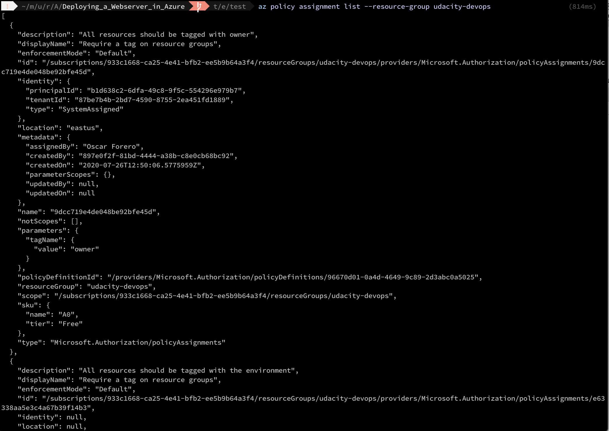
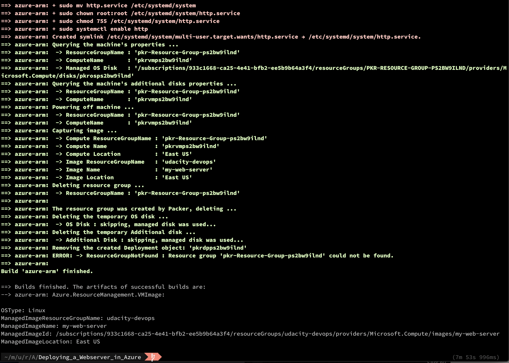
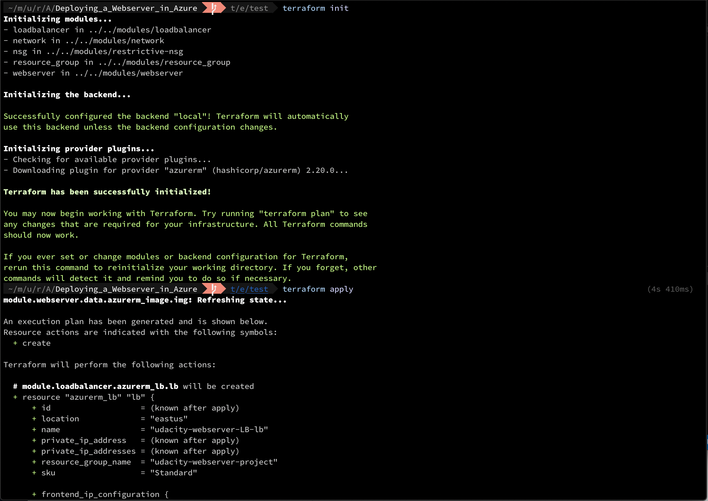
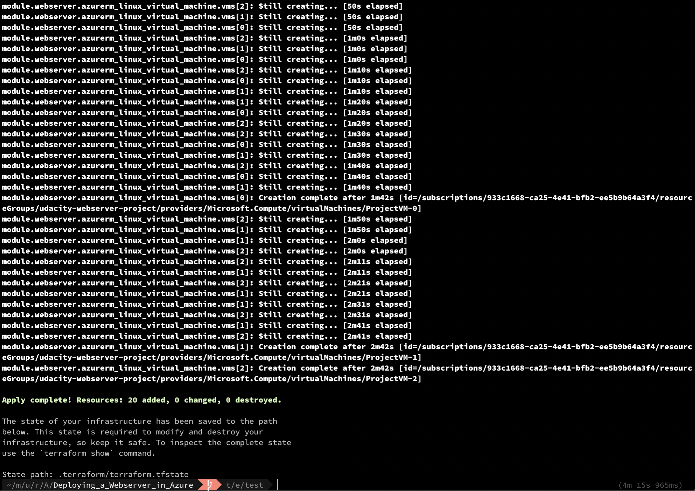

# Deploying a Webserver in Azure

This repository shows Infrastructure as code, using Packer and Terraform 
to deploy a "Hello World!" an HTTP server to the Azure cloud.

It deploys multiple VMs with load balancing betwen them.

To deploy the applications yourself you have to do the following steps:

## Install the tools

* [Install the Azure CLI](https://docs.microsoft.com/en-us/cli/azure/install-azure-cli?view=azure-cli-latest)
* [Install packer](https://learn.hashicorp.com/packer/getting-started/install)
* [Install terraform](https://learn.hashicorp.com/terraform/getting-started/install.html)

## Get your Azure Credentials
* Login into azure `az login`
* Create an rbac for loging in: `az ad sp create-for-rbac --role="Contributor" --scopes="/subscriptions/<subscription_id>"`
* Copy the client secret, we'll need it later.
* List your credentials: `az account show`

```
{
  "environmentName": "AzureCloud",
  "homeTenantId": "xxxxxxxx-xxxx-xxxx-xxxx-xxxxxxxx",
  "id": "xxxxxxxx-xxxx-xxxx-xxxx-xxxxxxxx",
  "isDefault": true,
  "managedByTenants": [],
  "name": "Free Trial",
  "state": "Enabled",
  "tenantId": "xxxxxxxx-xxxx-xxxx-xxxx-xxxxxxxx",
  "user": {
    "name": "xxxxxx@outlook.com",
    "type": "user"
  }
}
```

## Set the Credentials in Environment Variables

Terraform requires them to be prefixed with TF_VAR, to minimize the work, we'll use the same variables for packer.

**keep in mind that the names are case sensitive**

```
$ export TF_VAR_subscription_id=xxxxxxxx-xxxx-xxxx-xxxx-xxxxxxxx
$ export TF_VAR_client_id=xxxxxxxx-xxxx-xxxx-xxxx-xxxxxxxx
$ export TF_VAR_client_secret=xxxxxxxx-xxxx-xxxx-xxxx-xxxxxxxx
$ export TF_VAR_tenant_id=xxxxxxxx-xxxx-xxxx-xxxx-xxxxxxxx
```

## Policy Creation

Tge Policy was creted using the Azure Console, not terraform.



## Create the VM image

* go to the image folder: `cd images/folder`
* create the image `packer build server.json`



## Deploy the Infrastructure
* go to the infra folder: `cd terraform/environments/test`
* Initialize terraform: `terraform init`
* Create the infrastructure: `terraform apply` 





## Customizing your rollout

The customizable variables are in the `terraform.tfvars` in the folder `terraform/environments/test`,
you can change some variables like the name of the applicatio, or the number of VMs to use in the 
load balanced pool.
After chaging to the desired value, execute `terraform apply` again.